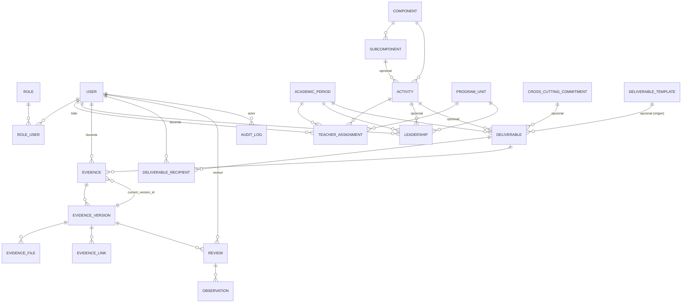

# Diccionario de datos — SIGAE-UTS

Este documento describe el esquema de base de datos implementado en
PostgreSQL. Por convención del proyecto, **todo el esquema está en
inglés** (tablas, columnas, modelos Eloquent, enums) — el español queda
reservado para textos de interfaz y contenido cargado por el usuario
(ver `CLAUDE.md` / especificación original, sección 4).

Convenciones: claves primarias `id` (bigint autoincremental), claves
foráneas `<entidad_singular>_id`, fechas con sufijo `_at` (datetime) o
`_date`/sin sufijo cuando son solo fecha civil (`start_date`,
`due_at` es datetime porque un entregable puede vencer a una hora
específica). Todas las tablas de dominio tienen `created_at`/`updated_at`
salvo `audit_logs`, que es de solo escritura por diseño.

## Diagrama entidad-relación



## Catálogo de tablas

### `users`

Cuentas de acceso de todo el personal (docentes, líderes, coordinación,
administradores, auditores) y su referencia institucional.

| Columna | Tipo | Nulo | Notas |
|---|---|---|---|
| `id` | bigint | no | PK |
| `name` | string | no | Nombre completo |
| `document_number` | string | sí | Único; cédula u otro identificador institucional |
| `email` | string | no | Único; usado para login |
| `email_verified_at` | timestamp | sí | No usado activamente (no hay verificación de correo en el MVP) |
| `password` | string | no | Hash bcrypt (cast `hashed` de Laravel) |
| `is_active` | boolean | no | Default `true`. Cuenta desactivada no puede iniciar sesión, pero conserva todo su histórico |
| `remember_token` | string | sí | Para "recordarme" |
| `created_at`, `updated_at` | timestamp | — | |

### `roles`

Catálogo fijo de roles del sistema (sembrado por `RoleSeeder`, no
editable desde la interfaz).

| Columna | Tipo | Notas |
|---|---|---|
| `id` | bigint | PK |
| `name` | string, único | Slug en inglés: `administrator`, `coordination`, `leader`, `teacher`, `auditor` |
| `label` | string | Etiqueta en español para mostrar en la interfaz (ej. "Administrador") |

### `role_user` (pivote)

Relación N:N entre `users` y `roles` — un usuario puede tener varios
roles simultáneamente (ej. un líder que también es docente).

| Columna | Notas |
|---|---|
| `user_id`, `role_id` | FK compuesta, únicas en conjunto |

### `program_units`

Programa académico o unidad donde aplica una asignación (catálogo
parametrizable).

| Columna | Tipo | Notas |
|---|---|---|
| `name` | string, único | |
| `is_active` | boolean | Se desactiva, nunca se borra |

### `components`

Docencia, Investigación, Extensión, Otras actividades, u otros que se
configuren (catálogo parametrizable).

| Columna | Notas |
|---|---|
| `name` | único |
| `is_active` | se desactiva, nunca se borra |

### `subcomponents`

Subcategoría dentro de un componente (ej. Procesos OACA, Procesos ODA,
Comités, Otras).

| Columna | Notas |
|---|---|
| `component_id` | FK a `components`, `restrictOnDelete` |
| `name` | único junto con `component_id` |
| `is_active` | se desactiva, nunca se borra |

### `activities`

Actividad concreta del catálogo, siempre ligada a un componente y
opcionalmente a un subcomponente.

| Columna | Notas |
|---|---|
| `component_id` | FK a `components`, `restrictOnDelete` |
| `subcomponent_id` | FK a `subcomponents`, nulo si no aplica, `nullOnDelete` |
| `name` | |
| `is_active` | se desactiva, nunca se borra |

### `academic_periods`

Periodo académico y su estado.

| Columna | Tipo | Notas |
|---|---|---|
| `name` | string, único | Ej. "2026-1" |
| `status` | string | Enum `App\Enums\AcademicPeriodStatus`: `planning`, `active`, `closed`, `archived` |
| `start_date`, `end_date` | date | Solo editables mientras `status = planning` |

Transiciones válidas: `planning → active → closed → archived`, y
excepcionalmente `closed → active` (reapertura, auditada — ver
`audit_logs`).

### `teacher_assignments`

Asignación de una actividad a un docente dentro de un periodo, con sus
horas. **Las horas son puramente informativas** (columna `assigned_hours`):
ninguna regla del sistema las usa para calcular avance ni cantidad de
entregables.

| Columna | Tipo | Notas |
|---|---|---|
| `user_id` | FK `users` (docente), `cascadeOnDelete` | |
| `academic_period_id` | FK, `restrictOnDelete` | |
| `activity_id` | FK, `restrictOnDelete` | |
| `program_unit_id` | FK, `restrictOnDelete` | |
| `assigned_hours` | decimal(5,2) | Informativo únicamente |
| `notes` | text, nulo | |

Única combinación `(user_id, academic_period_id, activity_id,
program_unit_id)` — evita duplicados exactos, pero permite que un
docente tenga varias actividades y que una actividad tenga varios
docentes.

### `leaderships`

Uno o varios líderes por ámbito (programa completo o una actividad
puntual) y periodo, con vigencia temporal.

| Columna | Tipo | Notas |
|---|---|---|
| `user_id` | FK `users` (líder), `cascadeOnDelete` | |
| `activity_id` | FK, nulo, `nullOnDelete` | Si es nulo, el ámbito es todo el `program_unit_id` |
| `program_unit_id` | FK, `restrictOnDelete` | |
| `academic_period_id` | FK, `restrictOnDelete` | |
| `starts_at`, `ends_at` | date | `ends_at` nulo = vigente. Se "finaliza" fijando `ends_at`, nunca se borra |

`User::canLeadAssignment()` resuelve si un líder puede ver/revisar una
`teacher_assignment` concreta a partir de estas columnas + la fecha
actual.

### `cross_cutting_commitments`

Clasificación para entregables que no dependen de una actividad de la
distribución (catálogo parametrizable).

| Columna | Notas |
|---|---|
| `name` | único |
| `is_active` | se desactiva, nunca se borra |

### `deliverable_templates`

Configuración reutilizable de un entregable (no tiene fechas propias;
sirve para prellenar entregables concretos).

| Columna | Tipo | Notas |
|---|---|---|
| `name`, `description`, `instructions`, `completion_criteria` | string/text | |
| `is_mandatory` | boolean | Default `true` |
| `periodicity_type` | string | Enum `App\Enums\PeriodicityType`: `single`, `by_term`, `monthly`, `biweekly`, `weekly`, `by_milestone`, `extraordinary` |
| `allowed_evidence_types` | json | Array de `App\Enums\EvidenceType`: `file`, `multiple_files`, `text`, `link` |
| `allowed_file_types` | json, nulo | Array de extensiones, ej. `["pdf","docx"]` |
| `max_files` | unsigned int | Default 1 |
| `max_file_size_mb` | unsigned int | Default 10 |
| `weight_percentage` | unsigned tinyint, nulo | 1–100 |
| `is_active` | boolean | |

### `deliverables`

La obligación concreta: fechas, reglas y ámbito. Copia (no referencia
en vivo) los valores de la plantilla al crearse, para que un cambio
posterior en la plantilla no altere retroactivamente entregables ya
creados.

| Columna | Tipo | Notas |
|---|---|---|
| `deliverable_template_id` | FK, nulo, `nullOnDelete` | Solo trazabilidad de origen |
| `academic_period_id` | FK, `restrictOnDelete` | |
| `activity_id` | FK, nulo, `restrictOnDelete` | Mutuamente excluyente con `cross_cutting_commitment_id` |
| `cross_cutting_commitment_id` | FK, nulo, `restrictOnDelete` | Mutuamente excluyente con `activity_id` |
| `name`, `description`, `instructions`, `completion_criteria` | | |
| `is_mandatory` | boolean | Solo los obligatorios afectan el % de avance |
| `periodicity_type` | string | Ver enum arriba |
| `opens_at`, `due_at` | datetime | |
| `closes_at` | datetime, nulo | |
| `allowed_evidence_types` | json | |
| `allowed_file_types` | json, nulo | |
| `max_files`, `max_file_size_mb` | unsigned int | |
| `weight_percentage` | unsigned tinyint, nulo | |

**Restricción a nivel de base de datos** (`CHECK`, no solo validación de
aplicación):

```sql
ALTER TABLE deliverables ADD CONSTRAINT deliverables_exactly_one_scope
CHECK ((activity_id IS NOT NULL)::int + (cross_cutting_commitment_id IS NOT NULL)::int = 1)
```

### `deliverable_recipients` (pivote)

Docente(s) destinatario(s) de un entregable concreto.

| Columna | Notas |
|---|---|
| `deliverable_id`, `user_id` | FK, únicas en conjunto, `cascadeOnDelete` |

Al guardar destinatarios se crea automáticamente una `evidence` en
estado `pending` para cada uno (`Deliverable::ensureEvidencesForRecipients()`);
si alguien deja de ser destinatario, su evidencia ya creada **no se
borra**.

### `evidences`

Registro presentado por el docente para un entregable — el "expediente"
que agrupa todas sus versiones.

| Columna | Tipo | Notas |
|---|---|---|
| `deliverable_id` | FK, `cascadeOnDelete` | |
| `user_id` | FK (docente), `cascadeOnDelete` | |
| `status` | string | Enum `App\Enums\EvidenceStatus`: `pending`, `draft`, `submitted`, `needs_adjustment`, `approved`, `expired`, `exempt` |
| `current_version_id` | FK a `evidence_versions`, nulo, `nullOnDelete` | Añadida en una migración posterior por dependencia circular con `evidence_versions` |

Única combinación `(deliverable_id, user_id)` — un docente tiene como
máximo un expediente de evidencia por entregable (el histórico vive en
`evidence_versions`, no en filas duplicadas de `evidences`).

### `evidence_versions`

Cada ajuste o reenvío genera una versión nueva; ninguna versión anterior
se modifica ni se borra.

| Columna | Tipo | Notas |
|---|---|---|
| `evidence_id` | FK, `cascadeOnDelete` | |
| `version_number` | unsigned int | Único junto con `evidence_id` |
| `description` | text, nulo | Notas del docente; también es el contenido cuando el tipo de evidencia incluye "texto" |
| `submitted_at` | datetime, nulo | Nulo mientras es borrador; al fijarse, la versión queda protegida contra edición |
| `created_by` | FK `users`, `restrictOnDelete` | |

### `evidence_files`

Archivo adjunto a una versión de evidencia.

| Columna | Tipo | Notas |
|---|---|---|
| `evidence_version_id` | FK, `cascadeOnDelete` | |
| `original_name` | string | Nombre visible para el usuario |
| `stored_name` | string, único | Nombre real en disco — generado aleatoriamente, nunca predecible |
| `disk_path` | string | Ruta relativa dentro del disco `local` (privado, `storage/app/private`, sin URL pública) |
| `mime_type` | string | Detectado del archivo real, no solo por extensión |
| `size_bytes` | unsigned bigint | |

### `evidence_links`

Enlace registrado como soporte.

| Columna | Notas |
|---|---|
| `evidence_version_id` | FK, `cascadeOnDelete` |
| `url` | |
| `label` | nulo |

### `reviews`

Decisión de un líder/coordinación/administrador sobre una versión de
evidencia concreta.

| Columna | Tipo | Notas |
|---|---|---|
| `evidence_version_id` | FK, `cascadeOnDelete` | |
| `reviewer_id` | FK `users`, `restrictOnDelete` | |
| `decision` | string | Enum `App\Enums\ReviewDecision`: `approved`, `returned` |
| `decided_at` | datetime | |

### `observations`

Comentario asociado a una revisión (obligatorio si la decisión es
`returned`).

| Columna | Notas |
|---|---|
| `review_id` | FK, `cascadeOnDelete` |
| `body` | text |

### `audit_logs`

Bitácora de acciones críticas. **Sin `updated_at`** — es un registro de
solo escritura desde el punto de vista de la aplicación (no existe
ninguna ruta que permita editarlo o borrarlo).

| Columna | Tipo | Notas |
|---|---|---|
| `user_id` | FK `users`, nulo, `nullOnDelete` | Actor; nulo en intentos de login fallidos |
| `action` | string | Ej. `login`, `login_failed`, `login_blocked_inactive`, `logout`, `created`, `updated` |
| `auditable_type`, `auditable_id` | morph, nulos | Referencia polimórfica al registro afectado |
| `metadata` | json, nulo | Cambios (`changes`) y campos redactados (`redacted_fields`) — nunca contiene contraseñas |
| `ip_address` | string(45), nulo | |
| `created_at` | datetime | Único timestamp de la tabla |

## Tablas de infraestructura de Laravel (no son parte del modelo de dominio)

`cache`, `jobs`, `job_batches`, `failed_jobs`, `password_reset_tokens`,
`sessions` — generadas por el framework para cachés, colas, la sesión
con `SESSION_DRIVER=database`, etc. No requieren diccionario propio.

## Desviaciones respecto al modelo conceptual original

Tres tablas mencionadas en la especificación inicial **no se
implementaron**, con su justificación:

- **`system_parameters`**: no se necesitó ninguna configuración global
  tipo llave-valor — todo lo "parametrizable" del sistema (componentes,
  subcomponentes, actividades, programas, compromisos transversales,
  plantillas de entregables) terminó siendo un catálogo propio con su
  propia tabla y pantalla de administración, que es más explícito y
  seguro (con sus propias validaciones) que un almacén genérico.
- **`imports`**: la carga masiva desde plantilla (Excel/CSV) para la
  distribución docente quedó fuera de esta entrega — la especificación
  la marca como "opcional" y es un módulo considerable por sí solo
  (plantilla, validación fila por fila, reporte de errores).
- **`notifications`**: no se implementó un sistema de notificaciones
  push/email — la especificación lo plantea como opcional ("puede usar
  el sistema nativo de Laravel"), y el seguimiento necesario ya lo
  cubren los paneles del módulo 8 (pendientes, próximos vencimientos,
  bandeja de revisión) sin necesidad de un canal de notificación aparte.
